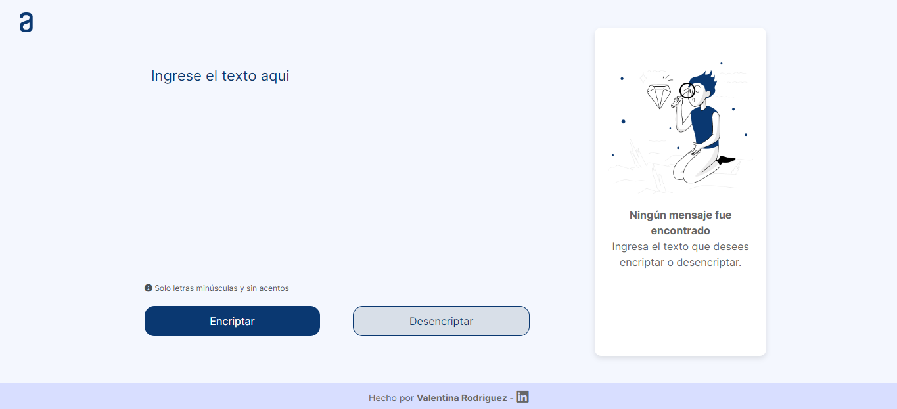

# Challenge Encriptador de Texto - Alura ONE

<p align="center">
     <a href="https://valeen-rodriguez.github.io/challenge-encriptador-de-texto/"></a>
</p>

<div align="center">

[Demo | Github Pages](https://valeen-rodriguez.github.io/challenge-encriptador-de-texto/)
     
</div>

---

## 🚀 Descripción

Challenge de Alura que se basa en la encriptación de textos, asi poder intercambiar mensajes secretos con otras personas y que sepan el secreto de la encriptación utilizada.

---

## 💻 Lenguajes Utilizados

<ul align="center" display="flex">
   
    HTML
  &#8287;&#8287;&#8287;&#8287;&#8287;&#8287;&#8287;&#8287;&#8287;&#8287;&#8287;&#8287;&#8287;&#8287;&#8287;&#8287;&#8287;&#8287;&#8287;&#8287;&#8287;&#8287;&#8287;&#8287;
  
   CSS
  &#8287;&#8287;&#8287;&#8287;&#8287;&#8287;&#8287;&#8287;&#8287;&#8287;&#8287;&#8287;&#8287;&#8287;&#8287;&#8287;&#8287;&#8287;&#8287;&#8287;&#8287;&#8287;&#8287;&#8287;
    
    Javascript
</ul>

---

## 🔑 Llaves de encriptacion

Las llaves de encriptacion solicitadas son las siguientes:

- La letra "**a**" es convertida a "**ai**".
- La letra "**e**" es convertida a "**enter**".
- La letra "**i**" es convertida a "**imes**".
- La letra "**o**" es convertida a "**ober**"
- La letra "**u**" es convertida a "**ufat**"

---

## ✔️ Requisitos

- Debe funcionar solo con letras minúsculas.
- No deben ser utilizados letras con acentos ni caracteres especiales.
- Debe ser posible convertir una palabra para la versión encriptada también devolver una palabra encriptada para su versión original.

```
Por ejemplo:
"gato" => "gaitober"
gaitober" => "gato"
```

- La página debe tener campos para inserción del texto que será encriptado o desencriptado, y el usuario debe poder escoger entre as dos opciones.
- El resultado debe ser mostrado en la pantalla.

### Extras:

- Un botón que copie el texto encriptado/desencriptado para la sección de transferencia, o sea que tenga la misma funcionalidad del ` ctrl+C ` o de la opción "copiar" del menú de las aplicaciones.